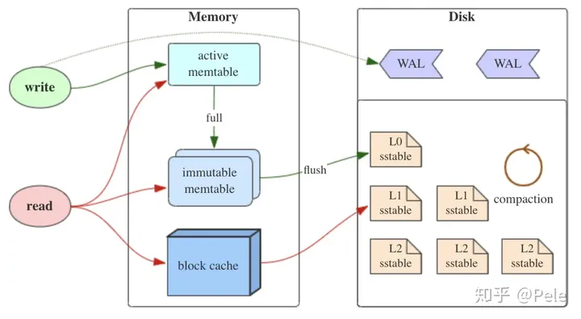

# level_db_xy
## 整体架构

## 基本概念
### [LSM(Log-Structured-Merge Tree)](https://cloud.tencent.com/developer/article/1143750)
1. 事实上，LSM树并不像B+树、红黑树一样是一颗严格的树状数据结构，它其实是一种**存储结构**，目前HBase,LevelDB,RocksDB这些NoSQL存储都是采用的LSM树。
2. LSM 的设计目标是提供比传统的 B+ 树更好的**写性能**。
   1. LSM 通过将磁盘的随机写转化为顺序写来提高写性能，而付出的代价就是牺牲部分读性能、写放大（B+树同样有写放大的问题）。
3. LSM 相比 B+ 树能提高写性能的本质原因是：外存——无论磁盘还是 SSD，其随机读写都要慢于顺序读写。
4. LevelDB 的写操作（Put/Delete/Write）主要由两步组成：
   1. 写日志（WAL，顺序写）。
   2. 写 MemTable（内存中的 SkipList）。

所以，正常情况下，LevelDB 的写速度非常快。
内存中的 MemTable 写满后，会转换为 Immutable MemTable，然后被后台线程 compact 成按 key 有序存储的 SSTable（顺序写）。
SSTable 按照数据从新到旧被组织成多个层次（上层新下层旧），点查询（Get）的时候从上往下一层层查找，所以 LevelDB 的读操作可能会有多次磁盘 IO（LevelDB 通过 table cache、block cache 和 bloom filter 等优化措施来减少读操作的 I/O 次数）。
后台线程的定期 compaction 负责回收过期数据和维护每一层数据的有序性。在数据局部有序的基础上，LevelDB 实现了数据的（全局）有序遍历。

### WAL(Write Ahead Log)
1. WAL预写日志，是数据库系统中常见的一种手段，用于保证数据操作的原子性和持久性。在使用 WAL 的系统中，所有的修改在提交之前都要先写入 log 文件中!

## 版本控制
1. googletest==>v1.14.0
## time schedule
2024.03.10-2024.03-16
1. 1天完成字符串视图Slice、内存分配器arena
2. 1天完成SkipList
3. 3天完成memtable [参考链接](https://cloud.tencent.com/developer/article/1625049)
4. 2天完成日志读写
5. 3天完成WriteBatch[参考链接](https://xiaobazhang.github.io/2019/01/30/leveldb%E4%B8%ADWriteBatch%E5%86%99%E6%93%8D%E4%BD%9C/)
6. 5天完成Sorted Strings Table(SSTable)部分
   1. 完成FilterPolicy
      1. 完成默认提供的BloomFilter [参考链接](https://sf-zhou.github.io/leveldb/leveldb_02_data_structure.html)
   2. 完成Cache
   3. 完成Logger
   4. 完成Env
   5. 完成Options
   6. 完成BlockBuilder
   7. 
