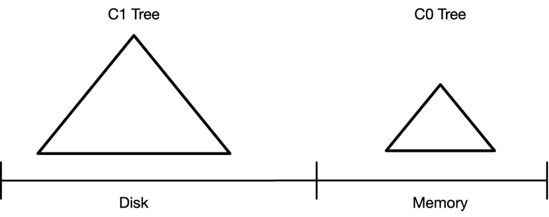
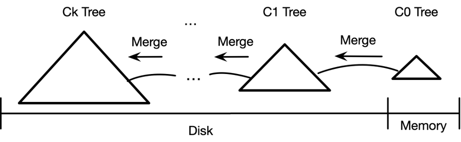

# level_db_xy
## 整体架构

## 基本概念
### [LSM(Log-Structured-Merge Tree)](https://cloud.tencent.com/developer/article/1143750)
1. 事实上，LSM树并不像B+树、红黑树一样是一颗严格的树状数据结构，它其实是一种**存储结构**，目前HBase,LevelDB,RocksDB这些NoSQL存储都是采用的LSM树。
2. LSM-Tree 全称是 Log Structured Merge Tree，是一种分层、有序、面向磁盘的数据结构，其核心思想是充分利用磁盘的顺序写性能要远高于随机写性能这一特性，将批量的随机写转化为一次性的顺序写。
   1. LSM树由两个或以上的存储结构组成，比如在论文中为了方便说明使用了最简单的两个存储结构。一个存储结构常驻内存中，称为C0 tree，具体可以是任何方便健值查找的数据结构，比如红黑树、map之类，甚至可以是跳表。另外一个存储结构常驻在硬盘中，称为C1 tree，具体结构类似B树。
   
   2. 在LSM树中，最低一级即最小的C0树位于内存,而更高级的C1、C2…树都位于磁盘里。数据会先写入内存中的C0树，当它的大小达到一定阈值之后，C0树中的全部或部分数据就会刷入磁盘中的C1树，如下图所示。在实际应用中，为防止内存因断电等原因丢失数据，写入内存的数据同时会顺序在磁盘上写日志，类似于预写日志(WAL)，这就是LSM这个词中Log一词的来历。
   
3. LSM 的设计目标是提供比传统的 B+ 树更好的**写性能**。
   1. LSM树在前互联网时代并未得到很好的重视，传统的关系型数据库的存储和索引结构依然以基于页面(Page)的B+树和HashTable为主。随着互联网规模的扩大和普及，在面对十亿级的用户接入，以及PB规模数据的写入，传统的关系型数据库已经难以支撑。
   2. LSM 通过将磁盘的随机写转化为顺序写来提高写性能，而付出的代价就是牺牲部分读性能、写放大（B+树同样有写放大的问题）。
4. LSM 相比 B+ 树能提高写性能的本质原因是：外存——无论磁盘还是 SSD，其随机读写都要慢于顺序读写。
5. LSM树各类操作：LSM树将任何的对数据操作都转化为对内存中的Memtable的一次插入。Memtable可以使用任意内存数据结构，如HashTable，B+Tree，SkipList等。对于有事务控制需要的存储系统，需要在将数据写入Memtable之前，先将数据写入持久化存储的WAL(Write Ahead Log)日志。由于WAL日志是顺序Append到持久化存储的，因此无论对磁盘还是SSD都是非常友好的。具体的数据操作参考这个[链接](https://open.oceanbase.com/blog/1793245952)，这个链接里还介绍了LSM-Tree的基本概念
6. LevelDB 的写操作（Put/Delete/Write）主要由两步组成：
   1. 写日志（WAL，顺序写）。
   2. 写 MemTable（内存中的 SkipList）。

所以，正常情况下，LevelDB 的写速度非常快。
内存中的 MemTable 写满后，会转换为 Immutable MemTable，然后被后台线程 compact 成按 key 有序存储的 SSTable（顺序写）。
SSTable 按照数据从新到旧被组织成多个层次（上层新下层旧），点查询（Get）的时候从上往下一层层查找，所以 LevelDB 的读操作可能会有多次磁盘 IO（LevelDB 通过 table cache、block cache 和 bloom filter 等优化措施来减少读操作的 I/O 次数）。
后台线程的定期 compaction 负责回收过期数据和维护每一层数据的有序性。在数据局部有序的基础上，LevelDB 实现了数据的（全局）有序遍历。

### WAL(Write Ahead Log)
1. WAL预写日志，是数据库系统中常见的一种手段，用于保证数据操作的原子性和持久性。在使用 WAL 的系统中，所有的修改在提交之前都要先写入 log 文件中!

## 组件版本控制
1. googletest==>v1.14.0
2. zstd==>v1.5.6
3. snappy==>1.2.0
4. crc32c==>1.1.0
## time schedule
2024.03.10-2024.03-16
1. 1天完成字符串视图Slice、内存分配器arena
2. 1天完成SkipList
3. 3天完成memtable [参考链接](https://cloud.tencent.com/developer/article/1625049)
4. 2天完成日志读写
5. 3天完成WriteBatch[参考链接](https://xiaobazhang.github.io/2019/01/30/leveldb%E4%B8%ADWriteBatch%E5%86%99%E6%93%8D%E4%BD%9C/)
6. 5天完成Sorted Strings Table(SSTable)部分
   1. 完成FilterPolicy
      1. 完成默认提供的BloomFilter [参考链接](https://sf-zhou.github.io/leveldb/leveldb_02_data_structure.html)
   2. 完成Cache，实际花费2天
   3. 完成Logger，完成logger_posix，目前仅支持posix，
   4. 完成Env
      1. 准备实现env_posix，这玩意是真难写啊
   5. 完成Options
      1. 集成zstd压缩
      2. 完成snapshot
      3. 补齐log_reader、log_writer缺失的crc校验
   6. 完成BlockBuilder
   7. 完成Block
   8. 完成TableBuilder
   9. 完成Table
      1.  完成BlockHandle
      2.  完成FilterBlock
      3.  完成Footer
   10. 完成Table相关的操作
       1.  遍历Table
           1.  完成two_level_iterator
       2.  完成TableCache
       3.  集成Bloom Filter到FilterBlock中
       4.  完成Table
7.  正式开始将之前的所有组件合并成一个高性能的NoSql！！！

