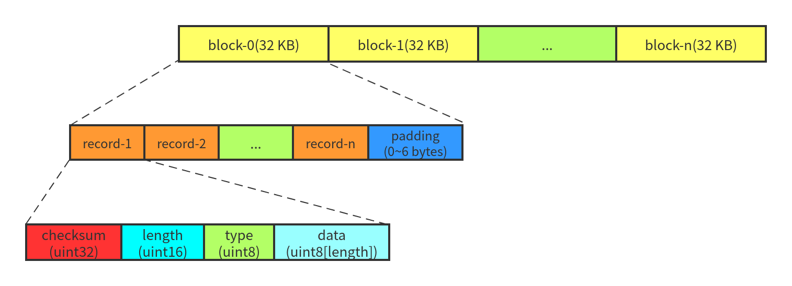

# [日志格式](https://juejin.cn/post/6844904137323184135)


# Writer::Writer(ns_env::WritableFile *dest, uint64_t dest_length)
```C++
Writer::Writer(ns_env::WritableFile *dest, uint64_t dest_length) :
    dest_(dest), block_offset_(dest_length % ns_log::kBlockSize) {
    InitTypeCrc(type_crc_);
}
```
Q：为什么dest_length要取模之后赋给block_offset_，而不是直接为0？

A：我个人认为这是为了让后面的数据全部单独占据一个块。
+ 举个例子，kBlockSize为300，dest_length为1000，那么block_offset_为100。
+ 在写入的时候，首先写入1~100个字节作为一个块，后面101~400、401~700、701~1000独占一整个块，这样可以避免最后一个块产生不必要的碎片

其次，这是一个构造函数，取模只有第一次，所以只会在第一次写入时起作用，会导致第一个数据的第一个块所占空间小于整块空间
# AddRecord
```C++
// 计算当前块所剩空间
int32_t const left_over = ns_log::kBlockSize - block_offset_;
assert(left_over >= 0);
// 当前块放不下日志头
if (left_over < ns_log::kHeaderSize) {
    // 虽然放不下日志头，但是还是要把块的剩余部分用0填满，这样在读取的时候，可以直接读取整个块
    if (left_over > 0) {
        static_assert(ns_log::kHeaderSize == 7, "");
        dest_->Append(ns_data_structure::Slice("\x00\x00\x00\x00\x00\x00", left_over));
    }
    // 另起一个新的块，方法就是重置块偏移为0
    block_offset_ = 0;
}
```

