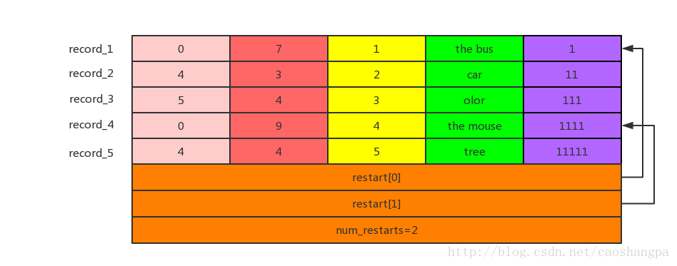

# 构造函数
options->block_restart_interval表示当前重启点（其实也是一条记录）和上个重启点之间间隔了多少条记录。
restarts_.push_back(0)，表示第一个重启点距离block data起始位置的偏移为0，也就是说第一条记录就是重启点。
# Add函数
```C++
void BlockBuilder::Add(const Slice& key, const Slice& value) {
  Slice last_key_piece(last_key_);
  assert(!finished_);
  assert(counter_ <= options_->block_restart_interval);
  assert(buffer_.empty() // No values yet?
         || options_->comparator->Compare(key, last_key_piece) > 0);
  size_t shared = 0;
  if (counter_ < options_->block_restart_interval) {
    // See how much sharing to do with previous string
    const size_t min_length = std::min(last_key_piece.size(), key.size());
    while ((shared < min_length) && (last_key_piece[shared] == key[shared])) {
      shared++;
    }
  } else {
    // 如果counter_=options_->block_restart_interval，说明这条记录就是重启点。
	// 将这条记录距离block data首地址的偏移添加到restarts_中，并使counter_ = 0，
    restarts_.push_back(buffer_.size());
    counter_ = 0;
  }
  const size_t non_shared = key.size() - shared;
 
  // 开始组建一条记录
  PutVarint32(&buffer_, shared);
  PutVarint32(&buffer_, non_shared);
  PutVarint32(&buffer_, value.size());
 
  // Add string delta to buffer_ followed by value
  buffer_.append(key.data() + shared, non_shared);
  buffer_.append(value.data(), value.size());
 
  // 此时last_key_还等于上一个key。resize用于取出last_key_与当前key中相同的前缀
  last_key_.resize(shared);
  // last_key_添加当前key中与上一个key的不同部分，此时last_key_与当前key是相等的。
  last_key_.append(key.data() + shared, non_shared);
  // 上面两句其实等效于last_key_=key.ToString()，但是像上面那样写可以使内存copy最小化
  assert(Slice(last_key_) == key);
  counter_++;
}
```
Add的调用应该在Reset之后，在Finish之前。
Add只添加KV对（一条记录）,重启点信息部分由Finish添加。
每次调用Add时，key应该越来越大。

在求相同前缀的长度时，为何要调用std::min来计算上一个key（last_key_piece）和当前key的长度呢？因为当前key虽然比上一个key大（通过Compare得出），但是不一定就比上一个key长。比如mouse和morning，由于u大于r，mouse是大于moring的。

需要注意的是，为了节约存储空间，每条记录的前三个字段是被压缩存储的（通过PutVarint32实现）
# Finish函数
```C++
Slice BlockBuilder::Finish() {
  // 添加重启点信息部分
  for (size_t i = 0; i < restarts_.size(); i++) {
    PutFixed32(&buffer_, restarts_[i]);
  }
  PutFixed32(&buffer_, restarts_.size());
  finished_ = true;
  return Slice(buffer_);
}
```
Finish只是在记录存储区后边添加了重启点信息，重启点信息没有进行压缩.

假设添加的5个KV对分别是("the bus","1")，("the car","11")，("the color","111")，("the mouse","1111")，("the tree","11111")，那么当options_->block_restart_interval=3时，block data的示意图如下所示。
