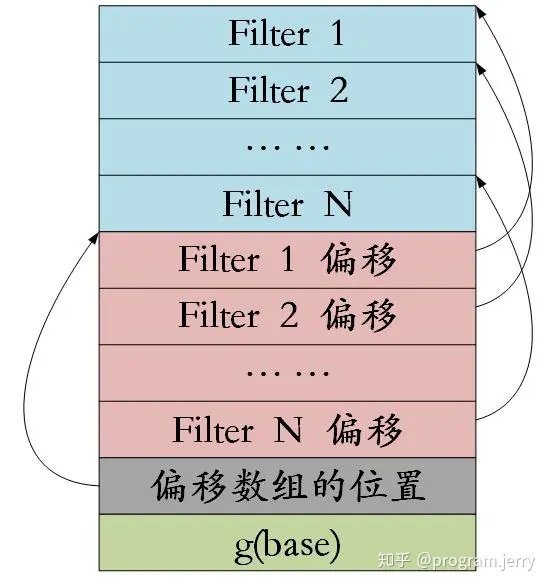

# Builder
在LevelDB源码里面有很多的Builder，这些Builder的主要功能就是实现一个构建器。类似于写者。

为什么说是构建器，类似于写者，而不是写者呢？主要原因是： - 构建器操作的对象是内存。也就是把要输出的结果按照想要的格式整理好。在内存中放置好。 - 而Writer主要是把内存里面的内容写入到文件里面。

所以在看代码的时候，需要注意：BlockBuilder也好，FilterBlockBuilder也好，或者是TableBuilder也好，实际上都是要按内存里面指定的格式整理在内存里面。

log_writer才是真正的把内存里面的内容写入到文件里面。
# FilterBlockBuilder
在 leveldb 中，在block中查找 data block使用二分法，能够达到 log(n) 的复杂度，如果想进一步提高，就需要用到 filter block 了。

如果说 data block 的作用是查找 key 对应的 value，那么 filter block 则是查找 key 是否存在于该 data block，起到提前过滤的作用，这也是 filter block 名字的由来。

filter block的想法其实很简单，就是拿空间换时间，例如我们可以构造 data block 内所有 key 的 hash table，将hash table对应的序列化数据存储到 fitler block.leveldb 并没有直接这么做，而是采用了 bloom filter，在达到O(1)的前提下，用一个巧妙的办法使用了更少的空间。

FilterBlock结构如下图：

https://zhuanlan.zhihu.com/p/45340857

## block_offset参数的作用
给定已有的一系列key，由于每个filter默认占2KB，block_offset主要是用于计算生成这些key的filter的个数！